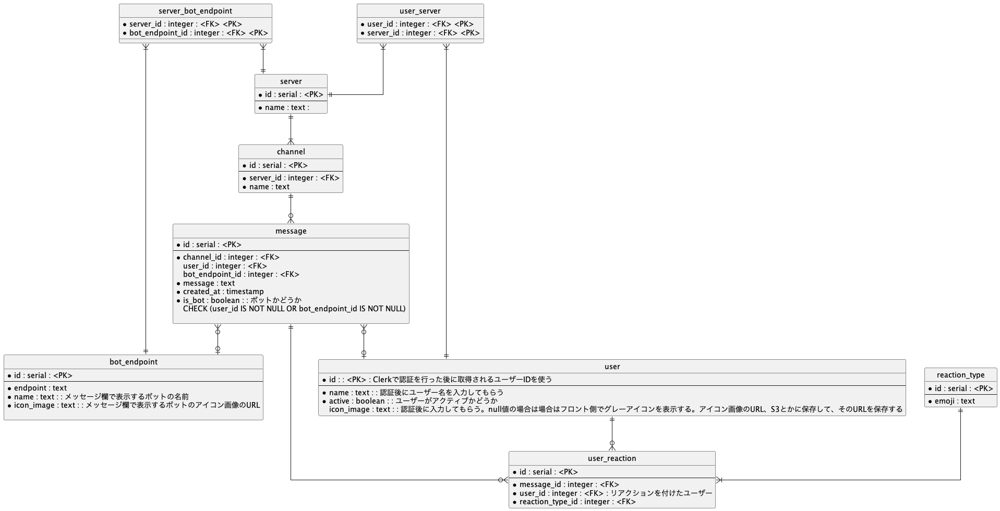

# バックエンドのAPIの仕様(予定)

### バックエンドのER図


### User登録

#### POST /registerUser

ヘッダ
```
Content-Type: application/json
Authorization: Bearer {jwt}
```

ボディ
```
{
    "name": "string",
    "active": true,
    "icon_url": "string",
}
```

レスポンス
```
{
    "id": "string",
    "name": "string",
    "active": true,
    "icon_url": "string",
}
```

[authorization経由でjwtを渡す例](https://clerk.com/docs/backend-requests/making/cross-origin)

[go sdkを用いたclerkの認証](https://clerk.com/docs/references/go/verifying-sessions)


### POST /registerServer

ヘッダ
```
Content-Type: application/json
Authorization: Bearer {jwt}
```

ボディ
```
{
    "name": "string",
}
```

レスポンス
```
{
    "id": "string",
    "name": "string",
}
```

### GET /getServers/:user_id
ユーザーが参加しているサーバーを取得

ヘッダ
```
Authorization: Bearer {jwt}
```

レスポンス
```
[
    {
        "id": "string",
        "name": "string",
    },
    {
        "id": "string",
        "name": "string",
       
    },
]
```


### GET /getChannels/:server_id
サーバーに紐づいているチャンネルを取得

ヘッダ
```
Authorization: Bearer {jwt}
```


レスポンス
```
[
    {
        "id": "string",
        "name": "string",
    },
    {
        "id": "string",
        "name": "string",
       
    },
]
```




### TODO:サーバーに招待するURLを発行するためのエンドポイントと処理を考える
参考になりそう
[招待コードを知っているユーザのみYoutubeURLを取得できるAPIをGoで実装してみた](https://zenn.dev/jordan/articles/db2c4fd08e7387)


### POST /registerBotEndpoint
botのエンドポイントを登録

ヘッダ
```
Content-Type: application/json
Authorization: Bearer {jwt}
```

ボディ
```
{
    "id": "string",
    "name": "string",
    "icon_url": "string",
    "endpoint": "string",
}
```



### POST {botのドメイン}/sendMessageToBot
ユーザーの入力を監視してメッセージをサーバーに登録されているbotに送信

ヘッダ
```
Content-Type: application/json
```

ボディ
```
{
    "message": "string",
    "channel_id": "string",
    "server_id": "string",
}
```

レスポンス
```
{
    "message": "string",
    "channel_id": "string",
    "server_id": "string",
}
```

#### 備考
ユーザーからwebsocket経由でメッセージを受け取った際にまず
ユーザーがメッセージを発したサーバーには登録されているbotが存在するかどうかをデータベースで検索する。
botからのレスポンスのメッセージがから文字じゃない場合は、
botの名前と共にユーザーメッセージの構造体にデータを入れてwebsocket経由でサーバーのチャネルに対して メッセージを送信する。



### Websocket /ws/:server_id/:channel_id/:user_id?jwt=xxxxx
websocketでサーバーにユーザーを接続させる。ユーザーのアクティブ情報をついでに更新する。


websocketを確立するためのハンドシェイクの段階でクエリパラメータによりjwtを受け取る。
authorizationヘッダーのbearerトークンとして渡したかったが、
websocketのハンドシェイクの時点ではヘッダーを渡せないため、 クエリパラメータでjwtを渡す。

[go-next-ts_chat](https://github.com/dhij/go-next-ts_chat/blob/main/server/cmd/main.go)のように
websocketに関連するhandler(websocketの通信だけでなくwebsocketを構築するための構造体に影響を与えるリクエストも含む。
参照先のリポジトリでは誰がどこの部屋に参加しているかを含むHub構造体の中身に影響を与えるHTTPリクエストも*Handlerのメソッドとして
追加されている)のレシーバーである *Handler構造体の中に部屋の構造を含む構造体(サンプルリポジトリではHub)を追加してHandlerを作成する。

今回は
```
type Hub struct {
    rooms map[string]*Server
    .....
}

type Server struct {
    id string
    name string
    channels map[string]*Channel
    .....
}

type Channel struct {
    id string
    name string
    users map[string]*User
    .....
}

type User struct {
    id string
    name string
    active bool
    icon_url string
    .....
}
```
のような構造体を作成して、Hub構造体の中にチャットアプリケーション全体の構造を含むようにする。


### DELETE /ws/deleteChannel/:server_id/:channel_id
チャンネル削除

ヘッダ
```
Authorization: Bearer {jwt}
```

### 備考
server_idとchannel_nameをクエリパラメータで受け取り、それを元にチャンネルを削除する。
チャンネルを削除する際には、チャンネルが現在有効なwebsocketのコネクションを持っているかどうかを
Hub構造体の中のChannel構造体のidと比較して確認する。あった場合は、そのチャンネル全体のそのコネクションを切断する。
データベースも削除する。


### DELETE /ws/deleteServer/:server_id
サーバー削除

ヘッダ
```
Authorization: Bearer {jwt}
```

### 備考
server_idをクエリパラメータで受け取り、それを元にサーバーを削除する。
サーバーを削除する際には、チャンネルが現在有効なwebsocketのコネクションを持っているかどうかを
Hub構造体の中のServer構造体のidと比較して確認する。あった場合は、そのサーバー全体のそのコネクションを切断する。
データベースも削除する。

### DELETE /ws/deleteUser/:user_id
User削除


ユーザーに紐づいているユーザーリアクションテーブル

ヘッダ
```
Authorization: Bearer {jwt}
```

### 備考
user_idをクエリパラメータで受け取り、それを元にユーザーを削除する。
ユーザーを削除する際には、チャンネルが現在有効なwebsocketのコネクションを持っているかどうかを
Hub構造体の中のUser構造体のidと比較して確認する。あった場合は、そのユーザー全体のそのコネクションを切断する。
データベースも削除する。
#### TODO:ユーザーテーブルを削除した際のuser_reaction,user_messageテーブルのユーザーテーブル参照先が無くなることによるデータの欠落の問題を解決する。

### TODO:ユーザーのアクティブ状態を変更するエンドポイントを作成する。








