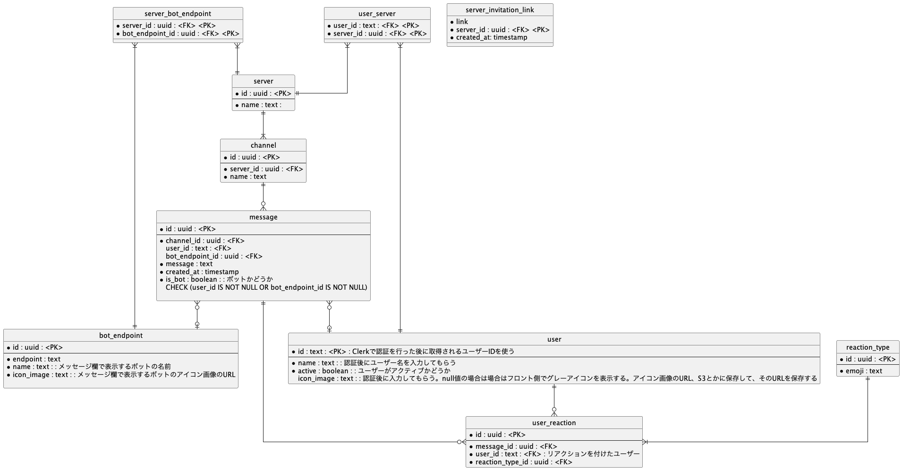

# バックエンドの API の仕様(予定)

### バックエンドの ER 図



### User 登録

#### POST /registerUser

ヘッダ

```
Content-Type: application/json
Authorization: Bearer {jwt}
```

ボディ

```
{
    "name": "string",
    "active": true,
    "icon_url": "string",
}
```

レスポンス

```
{
    "id": "string",
    "name": "string",
    "active": true,
    "icon_url": "string",
}
```

[authorization 経由で jwt を渡す例](https://clerk.com/docs/backend-requests/making/cross-origin)

[go sdk を用いた clerk の認証](https://clerk.com/docs/references/go/verifying-sessions)

### POST /registerServer

ヘッダ

```
Content-Type: application/json
Authorization: Bearer {jwt}
```

ボディ

```
{
    "name": "string",
}
```

レスポンス

```
{
    "id": "string",
    "name": "string",
}
```

### GET /getServers/:user_id

ユーザーが参加しているサーバーを取得

ヘッダ

```
Authorization: Bearer {jwt}
```

レスポンス

```
[
    {
        "id": "string",
        "name": "string",
    },
    {
        "id": "string",
        "name": "string",

    },
]
```

### GET /getChannels/:server_id

サーバーに紐づいているチャンネルを取得

ヘッダ

```
Authorization: Bearer {jwt}
```

レスポンス

```
[
    {
        "id": "string",
        "name": "string",
    },
    {
        "id": "string",
        "name": "string",

    },
]
```

### TODO:サーバーに招待する URL を発行するためのエンドポイントと処理を考える

参考になりそう
[招待コードを知っているユーザのみ YoutubeURL を取得できる API を Go で実装してみた](https://zenn.dev/jordan/articles/db2c4fd08e7387)

### POST /registerBotEndpoint

bot のエンドポイントを登録

ヘッダ

```
Content-Type: application/json
Authorization: Bearer {jwt}
```

ボディ

```
{
    "id": "string",
    "name": "string",
    "icon_url": "string",
    "endpoint": "string",
}
```

### POST {bot のドメイン}/sendMessageToBot

ユーザーの入力を監視してメッセージをサーバーに登録されている bot に送信

ヘッダ

```
Content-Type: application/json
```

ボディ

```
{
    "message": "string",
    "channel_id": "string",
    "server_id": "string",
}
```

レスポンス

```
{
    "message": "string",
    "channel_id": "string",
    "server_id": "string",
}
```

#### 備考

ユーザーから websocket 経由でメッセージを受け取った際にまず
ユーザーがメッセージを発したサーバーには登録されている bot が存在するかどうかをデータベースで検索する。
bot からのレスポンスのメッセージがから文字じゃない場合は、
bot の名前と共にユーザーメッセージの構造体にデータを入れて websocket 経由でサーバーのチャネルに対して メッセージを送信する。

### Websocket /ws/:server_id/:channel_id/:user_id?jwt=xxxxx

websocket でサーバーにユーザーを接続させる。ユーザーのアクティブ情報をついでに更新する。

websocket を確立するためのハンドシェイクの段階でクエリパラメータにより jwt を受け取る。
authorization ヘッダーの bearer トークンとして渡したかったが、
websocket のハンドシェイクの時点ではヘッダーを渡せないため、 クエリパラメータで jwt を渡す。

[go-next-ts_chat](https://github.com/dhij/go-next-ts_chat/blob/main/server/cmd/main.go)のように
websocket に関連する handler(websocket の通信だけでなく websocket を構築するための構造体に影響を与えるリクエストも含む。
参照先のリポジトリでは誰がどこの部屋に参加しているかを含む Hub 構造体の中身に影響を与える HTTP リクエストも*Handler のメソッドとして
追加されている)のレシーバーである *Handler 構造体の中に部屋の構造を含む構造体(サンプルリポジトリでは Hub)を追加して Handler を作成する。

今回は

```
type Hub struct {
    rooms map[string]*Server
    .....
}

type Server struct {
    id string
    name string
    channels map[string]*Channel
    .....
}

type Channel struct {
    id string
    name string
    users map[string]*User
    .....
}

type User struct {
    id string
    name string
    active bool
    icon_url string
    .....
}
```

のような構造体を作成して、Hub 構造体の中にチャットアプリケーション全体の構造を含むようにする。

### DELETE /ws/deleteChannel/:server_id/:channel_id

チャンネル削除

ヘッダ

```
Authorization: Bearer {jwt}
```

### 備考

server_id と channel_name をクエリパラメータで受け取り、それを元にチャンネルを削除する。
チャンネルを削除する際には、チャンネルが現在有効な websocket のコネクションを持っているかどうかを
Hub 構造体の中の Channel 構造体の id と比較して確認する。あった場合は、そのチャンネル全体のそのコネクションを切断する。
データベースも削除する。

### DELETE /ws/deleteServer/:server_id

サーバー削除

ヘッダ

```
Authorization: Bearer {jwt}
```

### 備考

server_id をクエリパラメータで受け取り、それを元にサーバーを削除する。
サーバーを削除する際には、チャンネルが現在有効な websocket のコネクションを持っているかどうかを
Hub 構造体の中の Server 構造体の id と比較して確認する。あった場合は、そのサーバー全体のそのコネクションを切断する。
データベースも削除する。

### DELETE /ws/deleteUser/:user_id

User 削除

ユーザーに紐づいているユーザーリアクションテーブル

ヘッダ

```
Authorization: Bearer {jwt}
```

### 備考

user_id をクエリパラメータで受け取り、それを元にユーザーを削除する。
ユーザーを削除する際には、チャンネルが現在有効な websocket のコネクションを持っているかどうかを
Hub 構造体の中の User 構造体の id と比較して確認する。あった場合は、そのユーザー全体のそのコネクションを切断する。
データベースも削除する。

#### TODO:ユーザーテーブルを削除した際の user_reaction,user_message テーブルのユーザーテーブル参照先が無くなることによるデータの欠落の問題を解決する。

### TODO:ユーザーのアクティブ状態を変更するエンドポイントを作成する。
